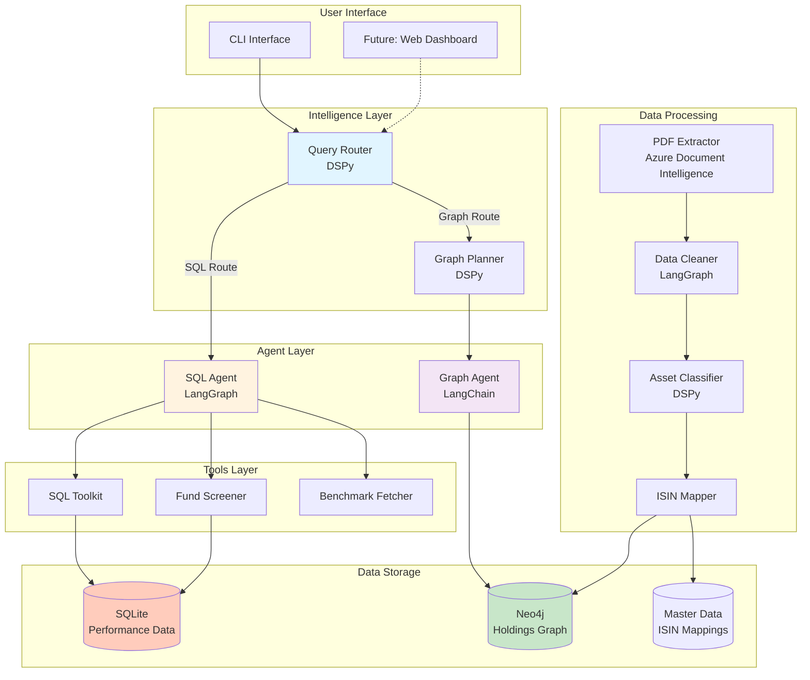
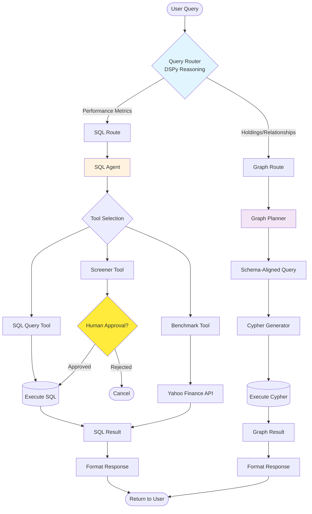
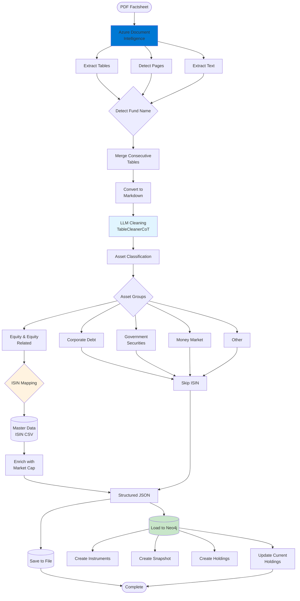
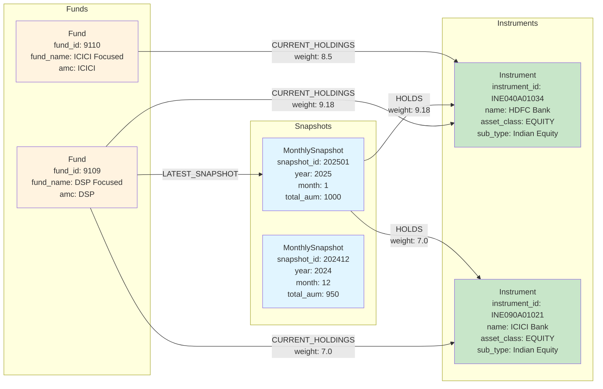
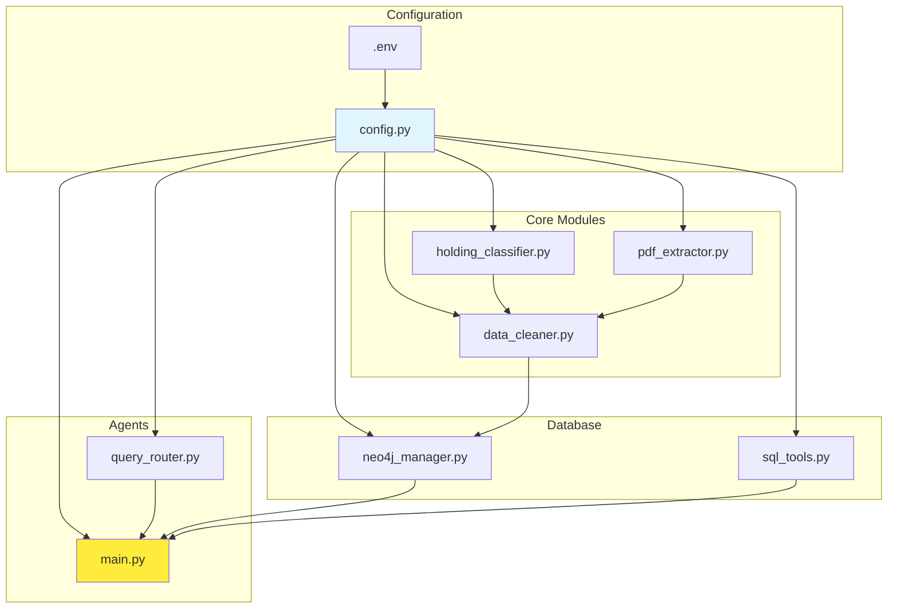
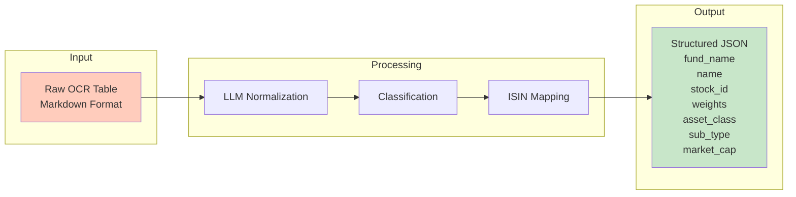

# System Architecture Diagram

## High-Level System Architecture

## Query Routing Flow

## PDF Processing Pipeline

## Neo4j Graph Data Model

## Component Dependencies

## Data Transformation Flow

